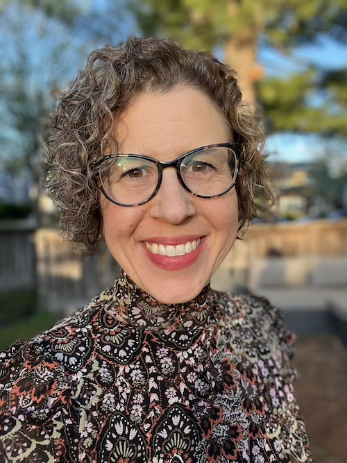

 
<h2 style="text-align: center;"><em>Break Open and Illuminate</em></h2>

You are smart, capable, introspective—and feeling stuck or struggling in some important area of your life. Perhaps you are a high performer in certain contexts, but seem to shut down or get counter-productive in others. Perhaps there is a painful or traumatic past experience that you need to process (even if it seems like you should have "gotten over it" by now). Maybe you are the person everyone leans on, but you're lacking adequate support for yourself.

I have provided therapy in university, community, and hospital settings. My current practice focuses on adults with anxiety, trauma, grief, depression, perfectionism, ADHD, impostor syndrome, and relationship or family concerns. I use somatic, cognitive, and mindfulness-based approaches, including EMDR and Acceptance & Commitment Therapy.

I will bring curiosity, perceptiveness, and investment in your success. My approach is collaborative, nonjudgmental, and direct. We will draw on depth-oriented approaches to support self-understanding and heal old wounds, along with practical skills to support you in making positive changes in your life today.
  
<h2 style="text-align: center;">About Me</h2>
 

  

Hello! I’m Laurel Severns Guntzel (M.Div, MA, LPCC) and I have always been deeply curious about the human condition. My background includes social justice activism, study of religion and theology, and since 2015, a career in psychology and mental health. Underlying all these pursuits have been existential and spiritual questions: How can we be most alive and authentic in our time on earth? Can we make meaning of suffering and injustice? How can we maintain integrity, connection, and purpose in the midst of a high-tech, capitalistic society?

I was born and raised in a diverse and vibrant community in Indianapolis, Indiana. I attended Earlham College, a Quaker liberal arts college that nurtured my love for learning and instilled a value of reflective practice. I lived in Washington DC, Chicago, and New York City before settling down with my husband in Minneapolis, where we live with two delightful and witty teenage sons and two eccentric cats. In addition to my private practice, I work in a university counseling center where I provide therapy to graduate and law students. 
  
<h2 style="text-align: center;">Credentials</h2>
 
- Minnesota Licensed Professional Clinical Counselor #01551 (Board of Behavioral Health and Therapy)
- MA, St. Mary’s University of Minnesota, Counseling & Psychological Services
- M.Div, Union Theological Seminary, Feminist Theology & Ritual
- BA, Earlham College, Religion
  
<h2 style="text-align: center;">Working with Me</h2>
My approach weaves depth psychology with present- and future- orientation. I find that sustainable growth happens through a combination of deep inner exploration and practical skill building: identifying what you want your life to be like; working with core beliefs and formative experiences; healing old or recent wounds; and pushing the edges of your comfort zone to create change. I believe therapy should be both challenging and affirming.

I enjoy forming meaningful therapeutic bonds with my clients and learning to see the world through their eyes. Each client brings unique facets to therapy through their identities, cultures, beliefs, life experiences, and personalities. Each person I work with broadens and nuances my perspectives, helping me see aspects of life that I had never considered before. When therapy is working well, my clients report feeling a deeper sense of connection to themselves and others, greater self-appreciation, and fuller engagement in their lives. 

At its best, therapy is not just symptom management or problem- solving, but has a prismatic quality of inner work. Through the facets of cognitive, emotional, somatic, and sometimes spiritual exploration of your self and history, the therapy process refracts layers of meaning that lead to insight, connection, and awe.
  
<h2 style="text-align: center;">Fees</h2>
 
- Consultation for potential clients (20 minutes by video call): Free
- Intake session (55 minutes): $225
- Therapy session (50 minutes): $185

I do not work directly with insurance companies. Fees are due at time of service. If you would like to submit your paid receipt for possible out-of-network reimbursement by your insurance company, I will provide a superbill with diagnosis and procedure codes. 
  
<h2 style="text-align: center;">FAQ</h2>
***Why don’t you accept insurance?***  
This was a difficult decision for me. I want mental health care to be accessible. However I do not want our work to be bound by the limitations and mercurial nature of insurance reimbursement, which is predicated on a pathologizing philosophy of mental health that only accounts for a portion of the meaningful work done in therapy. I do offer Superbills that you may submit to your insurance company for out-of-network reimbursement.

***When do you see clients?***  
I see clients in person only on Tuesday afternoons and evenings. I may have occasional telehealth availability on other days.

***How often will we meet?***  
When possible, I prefer to begin therapy by meeting weekly for at least the first 3-4 weeks to complete the intake and goal-setting process, establish the therapeutic relationship, and begin to gain traction on therapy goals. After that time, sessions may be weekly or every two weeks. However, sometimes I may only have an every-other-week opening.

<h2 style="text-align: center;">Contact and Location</h2>
Email: <a href="mailto:&#108;&#97;&#117;&#114;&#101;&#108;&#64;&#112;&#114;&#105;&#115;&#109;&#97;&#116;&#105;&#99;&#45;&#109;&#110;&#46;&#99;&#111;&#109;">&#108;&#97;&#117;&#114;&#101;&#108;&#64;&#112;&#114;&#105;&#115;&#109;&#97;&#116;&#105;&#99;&#45;&#109;&#110;&#46;&#99;&#111;&#109;</a> 
Voicemail: &#54;&#49;&#50;&#45;&#52;&#52;&#48;&#45;&#56;&#57;&#51;&#49; 
[Client Portal](https://prismatic.sessionshealth.com/clients/sign_inClient) (For existing clients)

<h2 style="text-align: center;">Office, hours, and accessibility</h2>
My office is located in The Nest therapy collective at 4801 ½ Nicollet Avenue in South Minneapolis. Street parking is typically available within 1 block of the entrance and the area is served by multiple bus lines.

The Nest is unfortunately not ADA accessible and requires climbing one flight of stairs. If mobility concerns are an issue, please reach out so we can discuss options.

I see clients in person on Tuesdays, with occasional telehealth availability at other times.

<h2 style="text-align: center;">Common Issues</h2>

  Anxiety  -  Trauma  - Depression  - Grief  - Perfectionism  - ADHD  - Impostor Syndrome  - Family of Origin Concerns

  Serving communities of Minneapolis, St. Paul, Richfield, Bloomington, Edina, St. Louis Park, Golden Valley, Robbinsdale, Hopkins, Crystal, Brooklyn Park, Brooklyn Center, New Brighton, Fridley, Columbia Heights, Roseville, Mendota Heights, and other Minnesota locations

